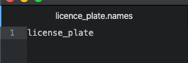
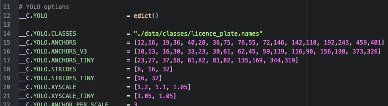
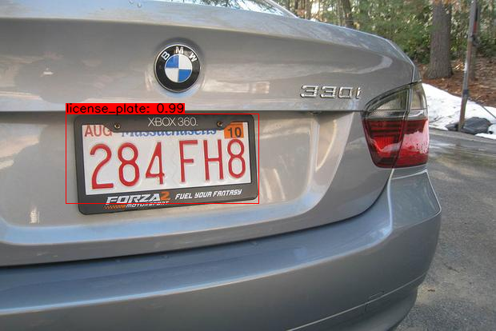

# Darknet-YOLO-with-Tensorflow

Darknet YOLO architectures implemented in Tensorflow and Tensorflow Lite.


[](https://www.python.org/)


[](https://www.tensorflow.org/)


---

## Before You start:

- [ ] In the first place You need to **have Darknet YOLOv3 or v4 weights to work with**. Weights might be either **custom trained** or **pre-trained** on benchmark [COCO dataset](https://cocodataset.org/#home). To download pre-trained `yolov4.weights` click [here](https://github.com/AlexeyAB/darknet/releases/download/darknet_yolo_v3_optimal/yolov4.weights).
- [ ] Except weights, `.names` file is required for model to have class labels reference. For benchmark COCO dataset, file `coco.names` is already available [here](https://github.com/patryklaskowski/Darknet-YOLO-with-Tensorflow/blob/master/data/classes/coco.names).

## Start

### 1. Prepare environment

```
git clone https://github.com/patryklaskowski/Darknet-YOLO-with-Tensorflow.git
cd Darknet-YOLO-with-Tensorflow
python3 -m venv env
source env/bin/activate
pip install -U pip
pip install -r requirements.txt
```

### 2. Put `.weights` file in `./data/` folder.

File with Darknet YOLO weights that does **not** fit in Tensorflow but Darknet.

<p align='center'>
  <table border=3>
    <thead>
      <td>yolov4.weights<br>(COCO dataset)</td>
      <td>yolov4_licence_plate.weights</td>
    </thead>
    <tr>
      <td><a href="https://github.com/AlexeyAB/darknet/releases/download/darknet_yolo_v3_optimal/yolov4.weights">Download</a></td>
      <td><a href="https://drive.google.com/file/d/1ZNGtzrDXavZd-1AFhXlftWoFxXg2Xm09/view?usp=sharing">Download</a></td>
    </tr>
  </table>
</p>

My `.weights` file is here: `./data/yolov4_licence_plate.weights`

### 3. Prepare `.names` file respectively to `.weights`.
`.names` file contains all class labels for specific YOLO weights where each line represents one class name.

#### NOTE
> `.names` file for domain `yolov4.weights` is already prepared on path `./data/classes/coco.names`.
> `coco.names` has 80 rows -> each one corresponds to single label.<br>

<p align='center'>
  <table border=3>
    <thead>
      <td>coco.names</td>
      <td>licence_plate.names</td>
    </thead>
    <tr>
      <td><a href="data/classes/coco.names">Show on path</a></td>
      <td><a href="https://drive.google.com/file/d/1k_8Ltv8WohGswhBgh6-1_fnW5LiCO7h1/view?usp=sharing">Download</a></td>
    </tr>
  </table>
</p>

My `.names` file is here: `./data/classes/licence_plate.names`

<p align="center"></p>

### 4. Adjust `config.py` file.

File is here: `./core/config.py`. Edit **only** `__C.YOLO.CLASSES` value to be path that points prepared `.names` file.

#### NOTE
> By default `__C.YOLO.CLASSES` points to `./data/classes/coco.names` file.<br>
> Therefore if you use domain `coco.names` there is no need to change.

According to my `.names` file: `__C.YOLO.CLASSES = "./data/classes/licence_plate.names"`

<p align="center"></p>

---

### Summarize

So far we have:
- [x] `.weights` on path `./data/yolov4_licence_plate.weights`
- [x] `.names` on path `./data/classes/licence_plate.names`
- [x] adjusted `__C.YOLO.CLASSES` param inside 'config.py' on path `./core/config.py`

You have environment prepared to perform conversion.

---

### 5. Convert Darknet weights into Tensorflow.

#### a. Into regular Tensorflow `.pb` model

`save_model.py` does the job.<br>
Required flags:
- `--weights` : path to weights `./data/yolov4_licence_plate.weights`
- `--output` : where to save output `./checkpoints/license_plate-416`
- `--input_size` : size of YOYLO input data `416` (px)
- `--model` : one of ['yolov3', yolov3] `yolov4`

```
python save_model.py --weights ./data/yolov4_licence_plate.weights --output ./checkpoints/license_plate-416 --input_size 416 --model yolov4
```

**This creates new folder `./checkpoints/license_plate-416` that stores `saved_model.pb` - actual Tensorflow model.**

#### b. Into Tensorflow Lite `.tflite` model

This option is lightweight. This solution trade off speed over accuracy.<br>
Great for edge devices such as mobile phones, raspberry pi and others.

```
python save_model.py --weights ./data/yolov4_licence_plate.weights --output ./checkpoints/license_plate-416 --input_size 416 --model yolov4 --framework tflite
python convert_tflite.py --weights ./checkpoints/license_plate-416 --output ./checkpoints/yolov4_license_plate-416.tflite
```

Difference makes `--framework tflite` flag.

**This creates new light weight Tensorflow object `./checkpoints/yolov4_license_plate-416.tflite` - actual Tensorflow Lite model.**

---

# Model (one of [`.pb`, `.tflite`]) has been successfully converted.
# Now ready to run.

---

## a. Run regular Tensorflow `.pb` model

### Detect image

```
python detect.py --weights ./checkpoints/license_plate-416 --size 416 --model yolov4 --images ./data/images/license_plate.jpg
```

<p align="center"></p>

#### NOTE
> To run multiple image detection, change flag `--images` using following pattern `--images './path/to/image1.jpg, ./path/to/image2.jpg, ./another/path/image.jpg'`

### Detect video

```
python detect_video.py --weights ./checkpoints/license_plate-416 --size 416 --model yolov4 --video ./data/video/road.mp4 --output ./detections/results.avi
```
<p align="center"></p>

#### NOTE
> To run predictions from webcam set `--video` flag argument to `0` as follows `--video 0`.

## b. Run lightweight Tensorflow Lite `.tflite` model

### Detect image

```
python detect.py --weights ./checkpoints/yolov4_license_plate-416.tflite --size 416 --model yolov4 --images ./data/images/license_plate.jpg --framework tflite
```

### Detect video

```
python detect_video.py --weights ./checkpoints/yolov4_license_plate-416.tflite --size 416 --model yolov4 --video ./data/video/road.mp4 --output ./detections/results.avi --framework tflite
```

---

## Command Line Args Reference

```
save_model.py:
  --weights: path to weights file
    (default: './data/yolov4.weights')
  --output: path to output
    (default: './checkpoints/yolov4-416')
  --[no]tiny: yolov4 or yolov4-tiny
    (default: 'False')
  --input_size: define input size of export model
    (default: 416)
  --framework: what framework to use (tf, trt, tflite)
    (default: tf)
  --model: yolov3 or yolov4
    (default: yolov4)

detect.py:
  --images: path to input images as a string with images separated by ","
    (default: './data/images/kite.jpg')
  --output: path to output folder
    (default: './detections/')
  --[no]tiny: yolov4 or yolov4-tiny
    (default: 'False')
  --weights: path to weights file
    (default: './checkpoints/yolov4-416')
  --framework: what framework to use (tf, trt, tflite)
    (default: tf)
  --model: yolov3 or yolov4
    (default: yolov4)
  --size: resize images to
    (default: 416)
  --iou: iou threshold
    (default: 0.45)
  --score: confidence threshold
    (default: 0.25)

detect_video.py:
  --video: path to input video (use 0 for webcam)
    (default: './data/video/video.mp4')
  --output: path to output video (remember to set right codec for given format. e.g. XVID for .avi)
    (default: None)
  --output_format: codec used in VideoWriter when saving video to file
    (default: 'XVID)
  --[no]tiny: yolov4 or yolov4-tiny
    (default: 'false')
  --weights: path to weights file
    (default: './checkpoints/yolov4-416')
  --framework: what framework to use (tf, trt, tflite)
    (default: tf)
  --model: yolov3 or yolov4
    (default: yolov4)
  --size: resize images to
    (default: 416)
  --iou: iou threshold
    (default: 0.45)
  --score: confidence threshold
    (default: 0.25)
```

---

## References:
- [hunglc007](https://github.com/theAIGuysCode/tensorflow-yolov4-tflite)
- [theAIGuysCode](https://github.com/hunglc007/tensorflow-yolov4-tflite)
