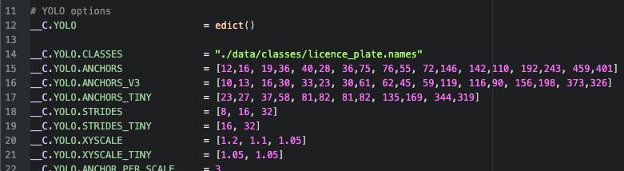
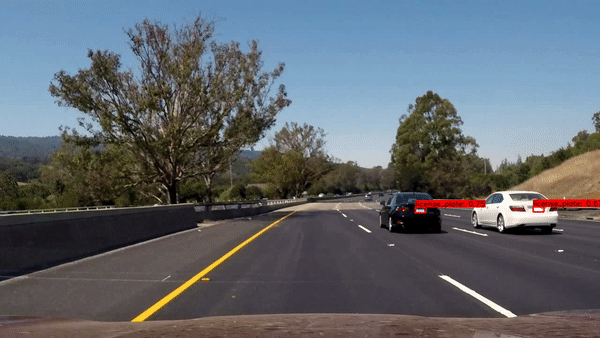

# [IN PROGRESS]

---

# Darknet-YOLO-with-Tensorflow

Darknet YOLO architecture implemented in Tensorflow and Tensorflow Lite.

---

## Before You start:

- [ ] First of all You need to **have any Darknet YOLOv3 or v4 weights to work with**. Weights might be either **custom trained** or **pre-trained** on benchmark [COCO dataset](https://cocodataset.org/#home). To download pre-trained yolov4.weights click [here](https://github.com/AlexeyAB/darknet/releases/download/darknet_yolo_v3_optimal/yolov4.weights).
- [ ] Along with weights, `.names` file is required for model to have classes lables reference.

## Start

### 1. Prepare environment

```
git clone https://github.com/patryklaskowski/Darknet-YOLO-with-Tensorflow.git
cd Darknet-YOLO-with-Tensorflow
python3 -m venv env
source env/bin/activate
pip install -U pip
pip install -r requirements.txt
```

### 2. Prepare `.weights` file in directory `Darknet-YOLO-with-Tensorflow/data/weights`.

This is file with Darknet YOLO model weights that are not suitable for Tensorflow but Darknet.

<table border=3>
  <thead>
    <td>yolov4.weights<br>(COCO dataset)</td>
    <td>yolov4_licence_plate.weights</td>
  </thead>
  <tr>
    <td><a href="https://github.com/AlexeyAB/darknet/releases/download/darknet_yolo_v3_optimal/yolov4.weights">Download</a></td>
    <td><a href="https://drive.google.com/file/d/1ZNGtzrDXavZd-1AFhXlftWoFxXg2Xm09/view?usp=sharing">Download</a></td>
  </tr>
</table>

Path of my `.weights` file: `Darknet-YOLO-with-Tensorflow/data/weights/yolov4_licence_plate.weights`

### 3. Prepare `.names` file respectively to `.weights`.
`.names` file contains all class labels for specific YOLO weights where each line represents one class name.

#### NOTE
> `.names.` file for domain `yolov4.weights` is already prepared on path `Darknet-YOLO-with-Tensorflow/data/classes/coco.names`.
> `coco.names` has 80 rows -> each one corresponds to single label.

<table border=3>
  <thead>
    <td>coco.names</td>
    <td>licence_plate.names</td>
  </thead>
  <tr>
    <td><a href="data/classes/coco.names">Show on path</a></td>
    <td><a href="https://drive.google.com/file/d/1k_8Ltv8WohGswhBgh6-1_fnW5LiCO7h1/view?usp=sharing">Download</a></td>
  </tr>
</table>

Path of my `.names` file: `Darknet-YOLO-with-Tensorflow/data/classes/licence_plate.names`

### 4. Adjust `config.py` file.

File is stored on path `Darknet-YOLO-with-Tensorflow/core/config.py`. Edit **only** `__C.YOLO.CLASSES` value to be path that points prepared `.names` file.

#### NOTE
> By default `__C.YOLO.CLASSES` points to `./data/classes/coco.names` file. So if you use domain `coco.names` there is no need to change.

According to my `.names`: `__C.YOLO.CLASSES = "./data/classes/licence_plate.names"`

<p align="center"></p>

---

### Summarizing
So far we have:
- [x] `.weights` on path `./data/weights/yolov4_licence_plate.weights`
- [x] `.names` on path `./data/classes/licence_plate.names`
- [x] adjusted `__C.YOLO.CLASSES` param inside 'config.py' on path `./core/config.py`

---

### 5. Convert Darknet weights to Tensorflow `.pb` regular object.
`save_model.py` does the job now. Required flags:
- `--weights` : path to weights `./data/yolov4_licence_plate.weights`
- `--output` : were to save output `./checkpoints/license_plate-416`
- `--input_size` : size of YOYLO input data `416` (px)
- `--model` : one of ['yolov3', yolov3] `yolov4`

```
python save_model.py --weights ./data/yolov4_licence_plate.weights --output ./checkpoints/license_plate-416 --input_size 416 --model yolov4
```

**This creates new folder `./checkpoints/license_plate-416` which store `saved_model.pb` - actual Tensorflow model**.

---

# Model has been successfully converted. Now ready to run.

---

# To use Tensorflow model

### Detect image

```
python detect.py --weights './checkpoints/license_plate-416' --size '416' --model 'yolov4' --images './data/images/license_plate.jpg'
```

#### NOTE
> To run multiple image detection change flag `--images` as with pattern follows `--images './path/to/image1.jpg, ./path/to/image2.jpg'`

<p align="center"></p>

### Detect video

```
python detect_video.py --weights ./checkpoints/license_plate-416 --size 416 --model yolov4 --video ./data/video/road.mp4 --output ./detections/results.avi
```
<p align="center"></p>

---

## References:
- [hunglc007](https://github.com/theAIGuysCode/tensorflow-yolov4-tflite)
- [theAIGuysCode](https://github.com/hunglc007/tensorflow-yolov4-tflite)


---
---
---
---

## Tensorflow

 ### Convert weights into .pb tensorflow model
`python3 save_model.py --weights ./data/yolov4.weights --output ./checkpoints/yolov4-416 --input_size 416 --model yolov4'

Be noticed that above line works also for YOLOv3. To convert YOLOv3 weights make sure you input `yolov3` as an argument for `--model` flag.
If you want to handle any tiny version of YOLO architecture don't forget to add `--tiny` flag as well as proper version of `--model`.
e.g. `python save_model.py --weights ./data/yolov4-tiny.weights --output ./checkpoints/yolov4-tiny-416 --input_size 416 --model yolov4 --tiny`

### Detect image
`python detect.py --weights './checkpoints/license_plate-416' --size '416' --model 'yolov4' --images './data/images/license_plate.jpg'`

To run detection on multiple images change value of `--images` as follows `--images "./path/to/image1.jpg, ./path/to/image2.jpg"`

### Detect video
'python detect_video.py --weights ./checkpoints/yolov4-416 --size 416 --model yolov4 --video ./data/video/video.mp4 --output ./detections/results.avi`

For webcam detection add 0 as argument for `--video` e.g. `--video 0`
Here also don't forget to specify both `--model` correctly and add `--tiny` if you handle tiny version of YOLO architecture.

---

## Tensorflow Lite

```
python save_model.py --weights ./data/yolov4.weights --output ./checkpoints/yolov4-lite-416 --input_size 416 --model yolov4 --framework tflite
python convert_tflite.py --weights ./checkpoints/yolov4-lite-416 --output ./checkpoints/yolov4-416.tflite
python detect.py --weights ./checkpoints/yolov4-416.tflite --size 416 --model yolov4 --images ./data/images/kite.jpg --framework tflite
python detect_video.py --weights ./checkpoints/yolov4-416.tflite --size 416 --model yolov4 --video ./data/video/video.mp4 --framework tflite
```
